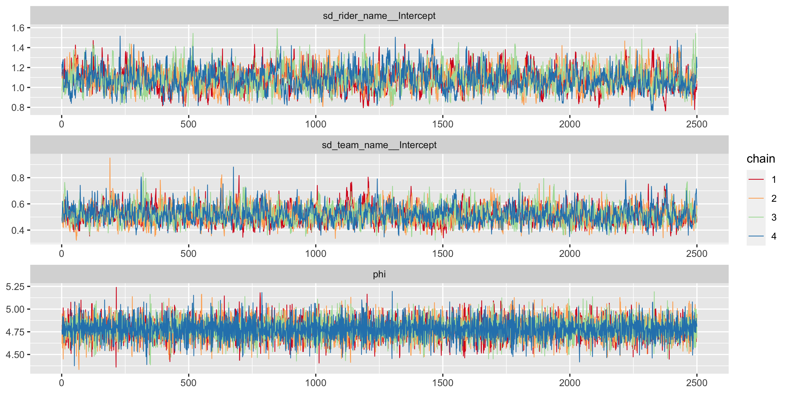
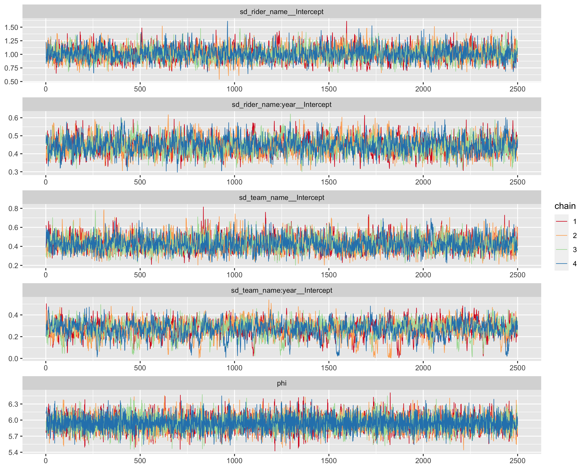
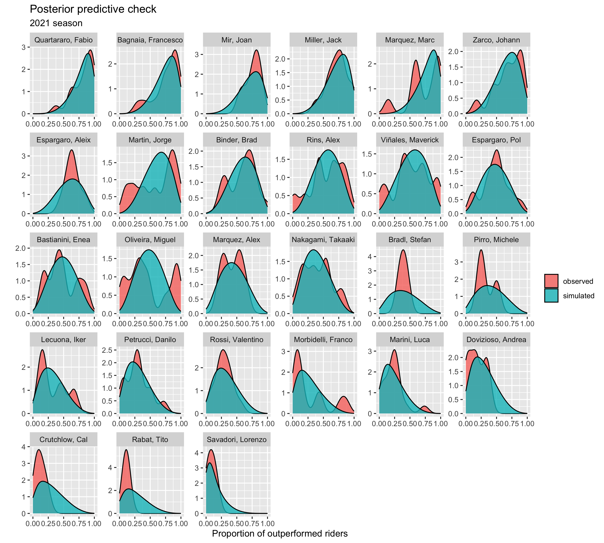
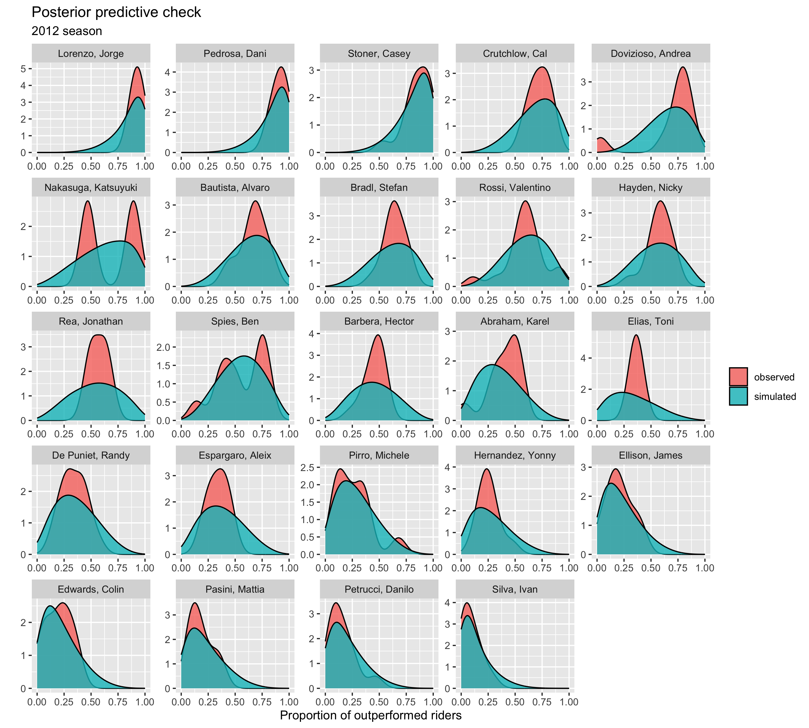

```{r setup, include=FALSE}
# This chunk sets echo = TRUE as default, that is print all code.
# knitr::opts_chunk$set can be used to set other notebook generation options, too.
# include=FALSE inside curly brackets makes this block not be included in the pdf.
knitr::opts_chunk$set(echo = TRUE)
```

```{r, include=FALSE}

library(posterior)
library(loo)
library(brms)
library(nlmeU)
library(corrplot)
library(nlme)
library(lattice)
library(plot.matrix)
library(insight)
library(firatheme)
library(tidyverse)
library(extrafont)

cmdstanr::check_cmdstan_toolchain(fix = TRUE)

#register_knitr_engine(override = FALSE)
```


# Introduction
Nowadays, given the enormous amount of data that is generated,  it is essential to be able to perform precise analyzes in order to have an important advantage over competitors. In particular, data analysis is proving increasingly important in the world of sport and currently most of high-level teams rely on data scientists. 
In this report, we will focus on the MotoGP sport which is the premier class of motorcycle road racing events held on road circuits. Using a public data-set of the MotoGP results from 2012 to 2021, we designed two different models to describe how drivers' ability and motorcycle's quality can affect the result of the final world champion. 
We were curious to understand what is more relevant between drivers and construction teams and whether the chances of final victory for ordinary drivers with first-class teams are higher than normal teams with champion drivers. The first model takes into account only the drivers and construction teams but the results were not satisfactory. Indeed, we found out that the performance of the motorbikes differ according to the technological development and the same motorbike can have opposite performances from year to year. That said, in the second model we introduced the year variable and thus the results have improved significantly.


# Data
The dataset used is public on the website at this [link](https://observablehq.com/@piratus/motogp-results-database). It is an SQLite database with MotoGP race results and it contains 15 tables: bikes, categories, circuits, countries, gp_country_codes, race_conditions, race_results, races, riders, season_categories, season_results, seasons, stage_names, stages, and teams. By using a JavaScript script, we downloaded the table race_results_view where each row represents the finish position of a driver for a specific race. The fields that interest us are:
(a) year: race year.
(b) sequence: race number for a specific year. Every first race of every year has sequence equal to 1, the second race has sequence equal to 2 and so on.
(c) rider_name: name of the drive.
(d) team_name: name of the construction team.
(e) position: final position for a specific driver in a specific race.

## Data Preparation

## Some EDA 

```{r}
data = read.csv("./data/race_results_view.csv")
```

```{r}
# Data processing 
## Restricting my analysis to the period 2012-2021
data <- data %>% filter(
  position > 0,
  year > 2011
)
## convert to factors
data <- data %>% mutate(
  rider_name  = as.factor(rider_name),
  team_name  = as.factor(team_name)
)

# New variables
data <- data %>% group_by(year, sequence) %>% mutate(  
  position_prop = (n() - position) / (n() - 1),        
  prop_trans = (position_prop * (n() - 1) + 0.5) / n() 
  )

data <- data %>% 
  mutate(
    team_name = case_when(team_name == "Movistar Yamaha MotoGP" ~ "Yamaha MotoGP",
                          team_name == "Monster Energy Yamaha MotoGP" ~ "Yamaha MotoGP",
                          team_name == "Yamaha Factory Racing" ~ "Yamaha MotoGP",
                          team_name == "Ducati Team" ~ "Ducati MotoGP",
                          team_name == "Mission Winnow Ducati"  ~ "Ducati MotoGP",
                          team_name == "Ducati Lenovo Team"  ~ "Ducati MotoGP",
                          team_name == "Repsol Honda Team"  ~ "Honda MotoGP",
                          team_name == "Team Suzuki MotoGP" ~ "Suzuki MotoGP",
                          team_name == "Team SUZUKI ECSTAR" ~ "Suzuki MotoGP",
                          team_name == "Red Bull KTM Factory Racing" ~ "KTM MotoGP",
                          team_name == "Aprilia Racing Team Gresini" ~ "Aprilia MotoGP",
                          TRUE ~ as.character(team_name))
  )
```
The variable position_prop represents how many rider_names you beat in a race, the variables position_trans is a transformation: Indeed The documentation for the R betareg package mentions that: "if y also assumes the extremes 0 and 1, a useful transformation in practice is (y * (n-1) + 0.5) / n where n is the sample size".

(see https://stats.stackexchange.com/a/134297/116878)

Preliminary plots


```{r}
## finish position
ggplot(data, aes(x = factor(position))) +
  geom_bar(fill = "darkmagenta") +
  labs(
    title = "Distribution of finish positions",
    subtitle = "Era (2012-2021)",
    x = "Finish position",
    y = "Count"
  )
```
This plot shows that sometimes not all drivers manage to finish the race.

```{r,include=FALSE}
data %>%
  filter(rider_name %in% c("Rossi, Valentino", "Quartararo, Fabio", "Marquez, Marc", "Lorenzo, Jorge")) %>%
  ggplot(aes(x = factor(position), fill = rider_name)) +
  geom_bar(position = position_dodge(preserve = "single")) +
  scale_x_discrete(limits=rev,breaks=seq(1, 23, 3)) +
  labs(
    x = "Finish position",
    y = "Count",
    title = "Different rider's finish positions",
    subtitle = "Conditional on finishing the race",
    fill = ""
  ) +
  theme(legend.position = "top") +
  facet_wrap(~year)
```


```{r}
data %>%
  filter(rider_name %in% c("Rossi, Valentino", "Crutchlow, Cal", "Marquez, Marc")) %>%
  ggplot(aes(x = prop_trans, fill = rider_name)) +
  geom_density(alpha = 0.5, bw = 0.1) +
  labs(
    x = "Smoothed proportion of outperformed rider_names",
    y = "Density",
    title = "Different rider_names' results",
    subtitle = "Proportion of finished drivers outperformed",
    fill = ""
  ) +
  theme(legend.position = "top", axis.text.x = element_text(angle = 45, vjust = 0.85)) +
  facet_wrap(~year)
```
From the plot above, we can observe that many pilots are not always present: indeed some pilots retired before 2021, some others arrived later than 2012.
We can also see an interesting trend for the driver Marc Marquez : till 2019 he was one of the top drivers in MotoGP, than in 2020 he had a shoulder injury that made him skip almost every race, and in 2021 he had a considerable decline in his performances.

# Description of the models

As already said in the introduction, our goal is to find the influence of the drivers' skills and motorcycle's qualities on the final position of a race: to do that we add a new source of variation in the model for every group.
So we have the standard deviation of the residuals $\sigma_{e}$ and the standard deviations of the by-group varying intercepts $\sigma_{group}$.

This is a common strategy in a frequentist framework, to go beyond the restrictive hypothesis of a traditional linear model that assumes independent and normally distributed observations with constant variance (homoscedasticity of the residuals).

Instead of rewriting the covariance matrix of the model, to allow heteroscedasticity and dependence, we add a new term that enables the estimation of the group level effect and the modelling of the dependence between observations driven by assumptions on between groups variability.

In our case, in a bayesian framework, hierarchical models can model statistical phenomena that occur on different levels by fitting models that include both constant and varying effects, using hyperprior parameters.

For driver d and constructor c , we specify the following generative multilevel model for the proportion of drivers beaten $y_{dc}$:

\begin{align*} 
y_{dc} \sim {\sf Beta}(\mu_{dc},\Phi) \\ 
logit(\mu_{dc}) = \beta_{d}  + \beta_{c}  \\ 
\beta_{d} \sim {\mathcal N}(0,\sigma^{2}_{d}) \\  
\beta_{c} \sim {\mathcal N}(0,\sigma^{2}_{c}) \\ 
\sigma_{d} \sim {\mathcal \Gamma}(1,1) \\ 
\sigma_{c} \sim {\mathcal \Gamma}(1,1) \\ 
\Phi \sim \Gamma(1,1) 
\end{align*}

The Beta distribution of the model does not follow the standard $(\alpha,\beta)$ parametrization, but rather a Beta regression formulation with a mean parameter $\mu$ and a dispersion parameter $\Phi$ (Ferrari and Cribari-Neto, 2004).

In particular, for regression analysis it is useful to model the mean of the response. Also it is typical to define the model so that it contains a precision (dispersion) parameter. In order to do that we can define $$\mu = \frac{\alpha}{\alpha+\beta}$$ and $$\Phi = \alpha + \beta$$ so that $$E(y) = \mu$$ and $$var(y) = \frac{\mu(1-\mu)}{1+\Phi}$$. such that $\mu$ is the mean of the response variable and $\Phi$ can be interpreted as a precision parameter

The (hypothetical) average driver at an average team will on
average have $\mu_{dc}$ = 0, which translates into a probability of 0.5 of beating other drivers.

Then, $\beta_{d}$ represents the mean driver skill as a log-odds ratio; e.g., if $\beta_{d}$ = 0,3, this means that the probability of beating other drivers is $\frac{1}{1 + e^{-0.3}} \simeq 0.57$

Taking into account that the performances of a driver can change over years (e.g. for his age or for his experience), and that also the quality of the motorbike can depends on the season (e.g. for new technologies) $y_{dcs}$:

\begin{align*} 
y_{dcs} \sim {\mathcal Beta}(\mu_{dcs},\Phi) \\ 
logit(\mu_{dcs}) = \beta_{d} + \beta_{ds} + \beta_{c} + \beta_{cs} \\ 
\beta_{d} \sim {\mathcal N}(0,\sigma^{2}_{d}) \\ 
\beta_{ds} \sim {\mathcal N}(0,\sigma^{2}_{ds}) \\ 
\beta_{c} \sim {\mathcal N}(0,\sigma^{2}_{c}) \\ 
\beta_{cs} \sim {\mathcal N}(0,\sigma^{2}_{cs}) \\ 
\sigma_{d} \sim {\mathcal \Gamma}(1,1) \\ 
\sigma_{ds} \sim {\mathcal \Gamma}(1,1) \\ 
\sigma_{c} \sim {\mathcal \Gamma}(1,1) \\ 
\sigma_{cs} \sim {\mathcal \Gamma}(1,1) \\ 
\Phi \sim \Gamma(1,1)
\end{align*}

So here we also included the seasonal driver form parameter $\beta_{ds}$, which represents yearly deviations from the long-term average driver skill and $\beta_{cs}$, which represents yearly deviations from the long-term average constructor advantage.

## Priors

We choose a weakly informative for the $\Phi$ parameters and weakly informative hyperpriors for the $\sigma$ parameters in both the models.
Indeed a $\Gamma(1,1)$ is a common choice, since it is a distribution that starting from 0 start decreasing with a "Gaussian like trend": it behaves similar to the right tail of a Gaussian or a Cauchy distribution centered in 0.  

```
list_drivers = list(y_riders = driver_prop, N = nrow(driver_prop), J_riders = ncol(driver_prop))
# fit_driver <- hierarchical_model_d$sample(data = list_drivers, refresh=1000)
```

```{r,eval=FALSE}
prior <- c(
    prior(gamma(1,1), class = sd),
    prior(gamma(1,1), class = phi)
   )
# basic model
fit_basic <- brm(
  formula = prop_trans ~ 0 + (1 | rider_name) + (1 | team_name),
  family  = Beta(),
  data    = data,
  prior = prior,
  backend = "cmdstanr",
  chains  = 4,
  cores   = 6,
  threads = 3,
  warmup  = 1000,
  iter    = 3500
)
write_rds(fit_basic, "./fit/fit_basic.rds")
```


```{r,include=FALSE}
fit_basic = readRDS("./fit/fit_basic.rds") %>% add_criterion("loo")
```


```{r,eval=FALSE}
# year model
fit_year <- brm(
  formula = prop_trans ~ 0 + (1 | rider_name) + (1 | team_name) + (1 | rider_name:year) + (1|team_name:year),
  family  = Beta(),
  prior = prior,
  data    = data,
  backend = "cmdstanr",
  chains  = 4,
  cores   = 6,
  threads = 2,
  warmup  = 1000,
  iter    = 3500
)
write_rds(fit_year, "./fit/fit_year.rds")
```

```{r,include=FALSE}
fit_year = readRDS("./fit/fit_year.rds") %>% add_criterion("loo")
```

# Rhat convergence diagnostics and interpretation

Basic model

```{r}
rhats <- rhat(fit_basic)
any(rhats[!is.nan(rhats)] > 1.01)
```

Year model

```{r}
rhats <- rhat(fit_year)
any(rhats[!is.nan(rhats)] > 1.01)
```

$\hat{R}$ is an estimate for potential scale reduction: it tell us if we are using the correct parameters. In particular as N->+$\infty$ it should decrease to 1.

Conceptually it represents the ratio between an overestimate of the marginal posterior variance (done using a linear combination between the within and the between variance) and the within variance.

If $\hat{R}$ is high, then we have reason to believe that proceeding with further simulations may improve our inference about the target distribution of the associated scalar estimand.

A rule of thumb is that if $\hat{R}$ < 1.01 we don't need to increase the number of simulations, so in this case everything is fine.

#  HMC specific convergence diagnostics

The HMC chains convergence can be determined by plotting the individual chains that have been executed for the main model parameters 

```{r}
hmc_conv_basic <- mcmc_plot(fit_basic, type = "trace") +
            facet_wrap(~parameter, nrow = 6, scales = "free") +
            scale_colour_brewer(type = "seq", palette = "Spectral")

#hmc_conv_basic
```
{width=50%,height=50%}
```{r,include=FALSE}
#ggsave("./img/hmc_chains_basic.png",plot=hmc_conv_basic,width = 10, height = 5)
```


```{r}
hmc_conv_year <- mcmc_plot(fit_year, type = "trace") +
            facet_wrap(~parameter, nrow = 6, scales = "free") +
            scale_colour_brewer(type = "seq", palette = "Spectral")

#hmc_conv_year
```
```{r,include=FALSE}
#ggsave("./img/hmc_chains_year.png",plot=hmc_conv_year, width = 10, height = 8)
```
{width=50%,height=50%}

By visual inspection it can be seen how the chains for the different parameters have converged. 

# Effective sample size diagnostic (n_eff)

```{r}
summary(fit_basic)
summary(fit_year)
```
The ess_bulk function produces an estimated Bulk Effective Sample Size (bulk-ESS) using rank normalized draws whereas the ess_tail function produces an estimated Tail Effective Sample Size (tail-ESS) by computing the minimum of effective sample sizes for 5% and 95% quantiles.
For each parameter, both Bulk-ESS and Tail-ESS are bigger than 100 (approximately) per Markov Chain which means that they are reliable and indicate that estimates of respective posterior quantiles are reliable.

# Model comparison 

```{r}
loo_results <- loo_compare(
  fit_basic,
  fit_year,
  model_names = c("Driver + constructor", "Driver + constructor + year")
)

loo_results
```

Comparing the models, the best one is the model described by drivers, constructors and years. Models are sorted in decreasing order: the first is the best whereas the last is the worst. The difference in ELPD (elpd_diff) between the two models is considerably high, this means that the 2 models have different predictive performance. Moreover, 
it is notable how taking the year into consideration leads to significantly better results.

Since the yearly model is better according to the LOO estimate, we proceed our inferences with it.

# Posterior predictive checking and interpretation 

Posterior predictive checks are an integral part of a Bayesian workflow, where we simulate the data we expect $\tilde{y}$ based on the model posterior, and we compare it with the observed data $y$, to see whether there's consistency. Basically, if $\tilde y$ is similar to $y$, then the model encapsulates the outcome well. In this case, we decided to run the posterior predictive checks on two different years, one in 2012 and one 2021 since there have been changes to both the rider roaster and teams between nine years. 

```{r,include=FALSE}
# 2021 posterior predictive check ----

pred_tab <-
  data %>%
  filter(year == 2021) %>%
  filter(!(rider_name %in% c("Pedrosa, Dani","Gerloff, Garrett","Dixon, Jake"))) %>% 
  select(rider_name, team_name, year)

# predict proportion of outperformed drivers
pp_tab <- posterior_predict(fit_year, pred_tab)

## Proportion plot ----
# yrep
pred_tab_long <-
  pred_tab %>%
  bind_cols(t(pp_tab) %>% as_tibble(.name_repair = "minimal") %>% 
  set_names(1:10000)) %>%
  pivot_longer(
    cols      = c(-rider_name, -team_name, -year),
    names_to  = "sample",
    values_to = "prop_trans"
  ) %>%
  mutate(origin = "simulated")

# y
true_tab_long <-
  data %>%
  filter(year == 2021) %>%
  filter(!(rider_name %in% c("Pedrosa, Dani","Gerloff, Garrett","Dixon, Jake")))%>% 
  select(rider_name, team_name, year, prop_trans) %>%
  mutate(origin = "observed")

ordered_levels <-
  true_tab_long %>%
  group_by(rider_name) %>%
  summarise(prop = mean(prop_trans)) %>%
  arrange(-prop) %>%
  pull(rider_name) %>%
  as.character()


PPC_2021 <- bind_rows(pred_tab_long, true_tab_long) %>%
            ggplot(aes(x = prop_trans, fill = origin)) +
            geom_density(alpha = 0.8, bw = .07) +
            facet_wrap(~factor(rider_name, levels = ordered_levels), scales = "free") +
            xlim(0, 1) +
            #theme_fira() +
            #scale_fill_fira() +
            #theme(legend.position = "top") +
            labs(
              title = "Posterior predictive check",
              subtitle = "2021 season",
              x = "Proportion of outperformed riders",
              y = "",
              fill = ""
            )
```

{width=50%,height=50%}
```{r,include=FALSE}
ggsave("./img/PPC_2021.png", plot=PPC_2021, width = 10, height = 9)
```


Note: In the 2021 season riders Dani Pedrosa, Jake Dixon and Gerloff Garrett participated in one race each, so they have been excluded from the posterior predictive check. 

```{r,include=FALSE}
# 2012 posterior predictive check ----

pred_tab <-
  data %>%
  filter(year == 2012) %>%
  filter(!(rider_name %in% c("Rapp, Steve","Battaini, Franco","Aoyama, Hiroshi","Vermeulen, Chris",
                         "Salom, David","Rolfo, Roberto", "Yates, Aaron"))) %>% 
  select(rider_name, team_name, year)

# predict proportion of outperformed drivers
pp_tab <- posterior_predict(fit_year, pred_tab)

## Proportion plot ----
# yrep
pred_tab_long <-
  pred_tab %>%
  bind_cols(t(pp_tab) %>% as_tibble(.name_repair = "minimal") %>% 
  set_names(1:10000)) %>%
  pivot_longer(
    cols      = c(-rider_name, -team_name, -year),
    names_to  = "sample",
    values_to = "prop_trans"
  ) %>%
  mutate(origin = "simulated")

# y
true_tab_long <-
  data %>%
  filter(year == 2012) %>%
  filter(!(rider_name %in%c("Rapp, Steve","Battaini, Franco","Aoyama, Hiroshi","Vermeulen, Chris",
                         "Salom, David","Rolfo, Roberto", "Yates, Aaron"))) %>% 
  select(rider_name, team_name, year, prop_trans) %>%
  mutate(origin = "observed")

ordered_levels <-
  true_tab_long %>%
  group_by(rider_name) %>%
  summarise(prop = mean(prop_trans)) %>%
  arrange(-prop) %>%
  pull(rider_name) %>%
  as.character()


PPC_2012 <- bind_rows(pred_tab_long, true_tab_long) %>%
            ggplot(aes(x = prop_trans, fill = origin)) +
            geom_density(alpha = 0.8, bw = .07) +
            facet_wrap(~factor(rider_name, levels = ordered_levels), scales = "free") +
            xlim(0, 1) +
            #theme_fira() +
            #scale_fill_fira() +
            #theme(legend.position = "top") +
            labs(
              title = "Posterior predictive check",
              subtitle = "2012 season",
              x = "Proportion of outperformed riders",
              y = "",
              fill = ""
            ) +
            scale_colour_brewer(type = "seq", palette = "Spectral")
```

{width=50%,height=50%}

```{r,include=FALSE}
#ggsave("./img/PPC_2012.png",plot = PPC_2012,width = 10, height = 9)
```

Note: in the 2012 season riders Aaron Yates, Chris Vermeulen, David Salom, Franco Battaini, Hiroshi Aoyama, Steve Rapp & Roberto Rolfo have been excluded since each of them had taken part in one Grand Prix. 

Both the plots show acceptable simulated values for each individual rider. One important thing to note is that for consistent high-performers (ex. Quartararo Fabio - 2021, Lorenzo Jorge - 2012) and low-performers (Salvadori Lorenzo - 2021), the posterior predictive distribution is over-dispersed, indicating a too low value for $\phi$ in these cases. 
On the other hand, for riders in the midfield (Marquez Alex - 2021, Jonathan Rea - 2012), the posterior predictive distribution seems to be a bit under-dispersed (too high value of $\phi$), since there is more variation in the observed data. 
But it can be seen that in both cases, the mean estimates do not seem too biased (especially in the midfield) so, we conclude that the model fits the observed data satisfyingly. 

# Interpretation of the results

To show yearly deviation for the drivers' performances, we decided to make inferences for a reduced set of riders from the 2012-2021 period (Rossi, Pedrosa, Crutchlow, Quartararo )

The model contains a parameter that indicates the seasonal form for each of the riders, $\beta_{ds}$, so we can project the skill trajectories for each of them throughout the years, while taking into consideration any advantages due to team form or any hidden parameter uncertainties. This is done by obtaining the posterior means and the 95% credible intervals for $\beta_{d} + \beta_{ds}$ on the set of riders, for each year 

```{r}
riders_focus <- c("Rossi","Crutchlow","Quartararo","Dovizioso")
rider_mean <- as_draws_df(fit_year) %>% select(-.chain, -.iteration) %>% select(contains("r_rider_name"),.draw) %>% select(-contains("year"))
rider_form <- as_draws_df(fit_year) %>% select(-.chain,-.iteration) %>% select(contains("r_rider_name:year"),.draw)
```

```{r}
rider_mean_long <-
  rider_mean  %>%
  pivot_longer(-.draw, names_to = "Rider", values_to = "Skill",
               names_pattern = "\\[(\\w{1,10}.*?),..*?\\]") %>% 
  mutate(Rider = as.factor(Rider))

rider_form_long <-
  rider_form %>%
  pivot_longer(-.draw, names_to = c("Rider", "Year"), values_to = "Form",
               names_pattern = "\\[(\\w{1,10}).*?(\\d{1,4}).*?,") %>%
  mutate(Rider = as.factor(Rider), Year = as.integer(Year))

rider_skill_summary <-
  merge(x=rider_form_long, y=rider_mean_long, by = c("Rider",".draw")) %>%
  mutate(skill_yr = Form + Skill) %>%
  group_by(Rider, Year) %>%
  summarise(
    est = mean(skill_yr),
    lower = quantile(skill_yr, 0.025),
    upper = quantile(skill_yr, 0.975),
  )


plt_skill_trajectory <-
  rider_skill_summary %>%
  ungroup() %>%
  filter(Rider %in% riders_focus) %>%
  mutate(Rider = fct_reorder(Rider, -est)) %>%
  ggplot(aes(x = Year, y = est, ymin = lower, ymax = upper)) +
  geom_ribbon(aes(fill = Rider), alpha = .2) +
  geom_line(aes(colour = Rider)) +
  geom_point(aes(colour = Rider)) +
  scale_fill_fira(guide = "none") +
  scale_colour_fira(guide = "none") +
  #theme_fira() +
  facet_wrap(~Rider) +
  labs(x = "Season", y = "Skill (log odds ratio)", title = "MotoGP Rider skill trajectories",
       subtitle = "period (2012-2021) Rider skill,\nconsidering for yearly team advantage.")


plt_skill_trajectory
```
The figure shows slight deviations in skills during the seasons, in particular drivers' performances may decrease as they get older.

A ranking based on skill can also be produced, by focusing on a single year, which is useful to produce on the latest year available in the dataset (2021)
```{r}
plt_rider_skill_2021 <-
  rider_skill_summary %>%
  ungroup() %>%
  filter(Year == 2021) %>%
  mutate(Rider = fct_reorder(Rider, est)) %>%
  ggplot(aes(y = Rider, x = est, xmin = lower, xmax = upper)) +
  geom_pointrange(colour = firaCols[3]) +
  #theme_fira() +
  labs(title = "2021 MotoGP rider skill",
       subtitle = "Accounting for yearly team advantage.",
       x = "Skill (log odds ratio)",
       y = "Rider")

plt_rider_skill_2021
```

In the 2021 grid, based on the figure above, it can be inferred that Quartararo is one of the most skilled drivers.

The reason behind the wide confidence interval with Marc Marquez is due to his injury and how it affected some races in the 2021 season (where he performs much lower than his standards). This combined with the fact that he has a high skill ranking due to producing high-performance results creates this level of uncertainity around his skill level. Indeed, even if the inference is only on the 2021 season $\beta{r}$ takes into account all the seasons. 

To determine how much a given bike from a certain team yields, we can compute the posterior means and the 95% confidence intervals for $\beta_t$ from the model

```{r}
team_focus <- c("Yamaha MotoGP", "Suzuki MotoGP", "Honda MotoGP", "KTM MotoGP", "Aprilia MotoGP")

team_mean <- as_draws_df(fit_year) %>% select(-.chain, -.iteration) %>% select(contains("r_team_name"),.draw) %>% select(-contains("year"))
team_form <- as_draws_df(fit_year) %>% select(-.chain, -.iteration) %>% select(contains("r_team_name:year"),.draw) 


team_mean_long <-
  team_mean  %>%
  pivot_longer(-.draw, names_to = "Team", values_to = "Advantage",
               names_pattern = "\\[(\\w{1,10}.\\w{1,10}.*?\\w{1,10}.*?),..*?\\]") %>%
  mutate(Team = gsub("\\."," ", Team),Team = as_factor(Team))

team_form_long <-
  team_form %>%
  pivot_longer(-.draw, names_to = c("Team", "Year"), values_to = "Form",
               names_pattern = "\\[(\\w{1,10}.\\w{1,10}.*?\\w{1,10}.*?)_.*?(\\d{1,4}).*?") %>%
  mutate(Team = gsub("\\."," ", Team), Team = as_factor(Team), Year = as.integer(Year))

team_samples <-
  merge(x=team_form_long, y=team_mean_long, by = c("Team",".draw")) %>%
  mutate(advantage_yr = Form + Advantage)

team_advantage_summary <-
  team_samples %>%
  group_by(Team, Year) %>%
  summarise(
    est = mean(advantage_yr),
    lower = quantile(advantage_yr, 0.055),
    upper = quantile(advantage_yr, 0.945),
  )

plt_advantage_trajectory <-
  team_advantage_summary %>%
  ungroup() %>% 
  filter(Team %in% team_focus) %>%
  mutate(Team = fct_relevel(Team, "Petronas Yamaha SRT", "Ducati MotoGP", "Honda MotoGP", "KTM MotoGP", "Aprilia Racing Team Gresini")) %>% 
  ggplot(aes(x = Year, y = est, ymin = lower, ymax = upper)) +
  geom_ribbon(aes(fill = Team), alpha = .2) +
  geom_line(aes(colour = Team)) +
  geom_point(aes(colour = Team)) +
  #scale_fill_fira(guide = "none") +
  #scale_colour_fira(guide = "none") +
  #theme_fira() +
  facet_wrap(~Team) +
  labs(x = "Season", y = "Advantage (log odds ratio)", title = "MotoGP team advantage trajectories",
       subtitle = "Period (2012-2021) constructor advantage,\naccounting for yearly rider skill.")

plt_advantage_trajectory
```


**(improve this section)**
Did Quartararo getting into the official Yamaha team (in 2020) boost his performances? To answer this question we put him in Petronas Yamaha SRT (Rossi's team in 2021) and put Rossi in Yamaha's official team, Yamaha MotoGP, Quartararo's team in 2021. Would Valentino Rossi have been able to beat Quartararo? (as an extra note, Rossi was in Yamaha's official team in 2019 and Quartararo was in SRT in 2019).

To answer this question we compute the predicted proportion of riders beaten $\tilde y_{rt}$ for both of the riders and then compute the posterior difference $\delta$ as follows:

\begin{align*}
\tilde{y}_{quart:YMH_{SRT}:2021} &= \text{logit}^{-1}(\beta_{quart} + \beta_{quart:2021} + \beta_{YMH_{SRT}} + \beta_{YMH_{SRT}:2021})
\\\tilde{y}_{rossi:YMH_{OFF}:2021} &= \text{logit}^{-1}(\beta_{rossi} + \beta_{rossi:2021} + \beta_{YMH_{OFF}} + \beta_{YMH_{OFF}:2021})
\\ \delta &= \tilde{y}_{quart:YMH_{SRT}:2021} - \tilde{y}_{rossi:YMH_{OFF}:2021}
\end{align*}

```{r}
rossi_yamaha_offical <- posterior_predict(fit_year, tibble(
  year = 2021,
  team_name = "Yamaha MotoGP",
  rider_name = "Rossi, Valentino"
))

quartararo_yamaha_srt <- posterior_predict(fit_year, tibble(
  year = 2021,
  team_name = "Petronas Yamaha SRT",
  rider_name = "Quartararo, Fabio"
))

delta <- quartararo_yamaha_srt - rossi_yamaha_offical

counterfactual_plot <- ggplot(tibble(d = delta), aes(x = d)) +
                      geom_density(fill = firaCols[5], alpha = 0.8) +
                      geom_vline(xintercept = mean(delta)) +
                      labs(
                        title = "Counterfactual prediction",
                        subtitle = "Quartararo in Yamaha SRT vs. Rossi in Yamaha official",
                        x = "Quartararo-Yamaha SRT advantage",
                        y = "Density"
                      )
counterfactual_plot
```

Based on this plot, it seems that even if Quartararo would have been traded to Yamaha SRT and Rossi to Yamaha Official, Quartararo is expected to have beaten Rossi regardless (with quite some degree of uncertainty). 

This could answer the question: did Yamaha  make a good choice by moving Quartararo to the official team and "demoting" Rossi to the B team? It seems so (even if there is some uncertainty)

# Predictive performance assessment

# Alternative priors testing

We tried to change the parameters of the $\Gamma$ distribution, using a distribution with a shorter support, so more informative

```
prior2 <- c(
    prior(gamma(0.01,0.01), class = sd),
    prior(gamma(0.01,0.01), class = phi)
   )

fit_year2 <- brm(
  formula = prop_trans ~ 0 + (1 | rider_name) + (1 | rider_name:year) + (1 | team_name)  + (1|team_name:year),
  family  = Beta(),
  data    = data,
  prior = prior2,
  backend = "cmdstanr",
  chains  = 4,
  cores   = 6,
  warmup  = 1000,
  iter    = 3500
)

```

```{r}
fit_year2 <- read_rds("./fit/fit_year2.rds")
summary(fit_year2)
```


We can see that also with a smaller support, the results are almost the same

We then tried to use the standard priors in brms, that are showed in the output:

```
fit_year3 <- brm(
  formula = prop_trans ~ 0 + (1 | rider_name) + (1 | rider_name:year) + (1 | team_name)  + (1|team_name:year),
  family  = Beta(),
  data    = data,
  backend = "cmdstanr",
  chains  = 4,
  cores   = 6,
  warmup  = 1000,
  iter    = 3500
)

prior_summary(fit_year3)
```

```{r}
fit_year3 <- read_rds("./fit/fit_year3.rds")
summary(fit_year3)
```

Also in this case, the changes are negligible

# Problems and potential improvements
During the project, we encountered some problems. The first issue was finding an idea and a reliable data set. After that, the initial idea was to use Stan with the data in the form of a matrix of observations and drivers However, this approach would have created multiple null entries (NA values) which are hard to handle using Stan. Therefore, we decided to switch to the brms library, which handles null entries automatically. The main difficulty was figuring out how to choose priors, in particular, how to define hyper-parameters. Moreover, defining priors in brms has been challenging and it took some time.


Although the model shows satisfactory results, a possible improvement could be to add more variables to the model. For example, a more in-depth analysis could be performed on the circuits, understanding which ones have common characteristics (e.g. circuits with many turns vs circuits with long straights) so as to be able to understand which are the weaknesses of motorbikes or riders and therefore where they should focus to improve.

Condizioni meteo?

# Conclusion

```{r}
# Driver versus constructor contributions ----
# random effects standard deviation summary
sfit <- summary(fit_year, prob = 0.95)
ranef_summary <- rbind(
  "constructor" = sfit$random$team_name,
  "constructor form" = sfit$random$`team_name:year`,
  "driver" = sfit$random$rider_name,
  "driver form" = sfit$random$`rider_name:year`
)[1:4, 1:4]
xtable::xtable(ranef_summary)

# how much of variance is due to car?
colSums(ranef_summary[1:2,]^2)/colSums(ranef_summary^2)

# and how much due to the driver?
colSums(ranef_summary[3:4,]^2)/colSums(ranef_summary^2)
```
From the table above, and from previous analysis, we can observe that in MotoGP the driver skill is more influent than the motorcycle on the result of a race.


# Self-reflection about what the group learned 

Working on this project has been challenging, but at the same time stimulating and has allowed us to learn different notions about Bayesian logic. First of all, we learned how to work as a team in order to be as efficient as possible, we initially made an high-level analysis and we divided the tasks. After that, we met in person one last time before delivering to review everything and resolve the last doubts. Moreover, we have learned how to approach a statistical problem from start to finish, we believe that the final project has taught us to combine what we did with the assignments. In particular,we learned that data collection and data cleaning are essential to have a reliable and bias-free result.